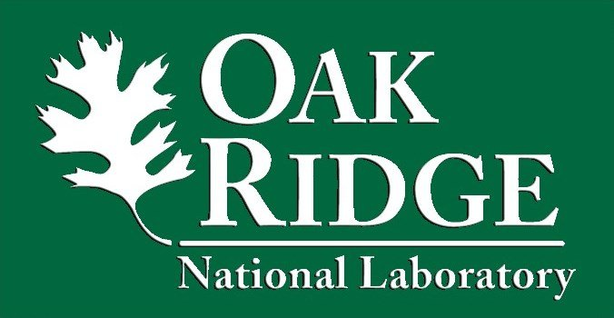
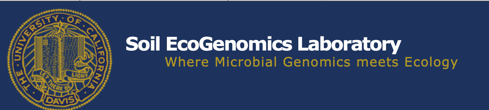

<left>  **Liyuan is working on improving the modeling performance of carbon cycle using the CLM-Microbe and CoMEND in the perspective of soil microbes. Such findings can hopefully contribute to improving our understanding of the role of soil microbes in carbon cycle and soil processes and mitigating climate change by mitigation soil microbial communities.**
 
 

 ##  **My labs**

 ##  **Oak Ridge National Laboratory**
## (**E**cological **M**odeling **A**nd **I**ntegration **L**ab) {-}
[{width=600px}](https://www.ornl.gov)
 
 

 ##  **Xu's Lab**
## (**E**cological **M**odeling **A**nd **I**ntegration **L**ab) {-}
[{width=600px}](http://sci.sdsu.edu/emaillab/)
 
 

 ##  **Rodrigues's Lab**

## (**S**oil **E**co**G**enomics **L**abratory) {-}
[{width=600px}](http://rodrigues.ucdavis.edu/index.html)
