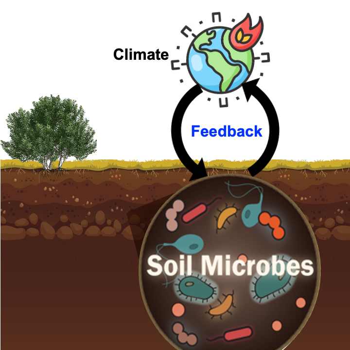
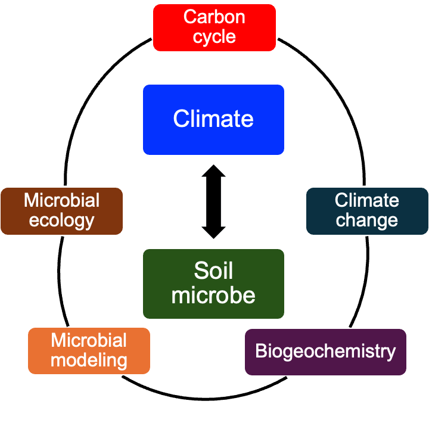
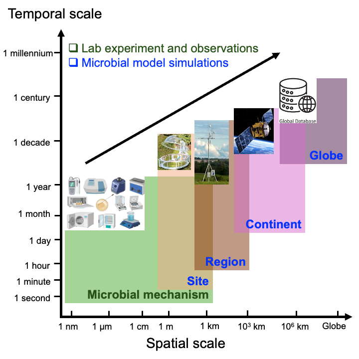

My research interests lay in the feedback between **Soil microbe-Climate** through Soil microbe-Carbon cycle-Climate interactions. I use a data-model integration approach to study microbial role in terrestrial carbon cycle that connects:

- Microbial Ecology
- Carbon cycle
- Climate change
- Biogeochemistry
- Microbial modeling

:::{layout-ncol=2}

::: {#first-column}
{height=450}

**Soil microbe-Climate feedback**

:::

::: {#second-column}
{height=450}

**Research interests**

:::

::::

My research spans a wide range of temporal and spatial scales, which includes the lab experiment and field observations and modeling research at different scales, ranging from seconds to century regarding temporal scale and from nano-meter to global-wide with respect to spatial scale. To investigate microbial methanisms in biogeochemical cycling, I participate field and lab experiment led by collaborators. By incorporating microbial mechanisms into ecosystem and Earth system models, I parameters the microbial models using observational data. Then, I apply the parameterized microbial models to investigate the microbial role in regulating carbon and nutrient cycles at site-, regional, continental-, and global scales. Across those scales, I perform data-model integration from varying sources, including autochamber, eddy covariance tower, ground overvation network, satellite remote sensing, and global databases. The knowledge gained from those data-model approaches are crucial for improving our understanding of Soil microbe-Climate feedback, enabling more accurate predictions of ecosystem trajectories in future world. Such knowledge provide insights for policymakers and stakeholders to develop more effective and targeted strategies for mitigating climate change by manipulating soil microbial community and enhancing soil carbon stability.

**Research ranging from various scales**

### **Topic 1: Biogeography of Soil Microbial Community**
Soil microbes play an essential role in soil carbon and nutrient biogeochemistry, impacting on various ecosystem processes, such as organic matter decomposition, soil formation, and nutrient availability. Thus, soil microbes determine the ultimate fate of soil carbon. However, the research on the biogeography of soil microbes and their turnover are still in its infancy. By compilating publications on soil microbial biomass and microbial turnover rates and analyzing with appropriate statistical approaches and integration with microbial models, I figured out the biogeographical pattern of soil microbial community and its turnover, identified their controls of distribution, and estimated the global budget of soil microbial biomass as well as global average of microbial biomass carbon turnover. **My research demonstrated that:**

- **The distribution of soil microbial (fungal and bacterial) biomass and their turnover rate showed clear biogeographical patterns.**
- **Biomass of fungi and bacteria and their ratio are controlled by different factors.**
- **Global biomass carbon budget is 12 Pg C for fungi and 4 Pg C for bacteria in topsoil.** 
- **Global microbial biomass carbon residence time was estimated as 38 (±5) days.**
- **Fungi show stronger biogeographic patterns in biomass carbon than bacteria.**
- **Edaphic properties dominate fungal necromass formation, while mean annual temperature controls bacterial necromass formation across sites.**

Related work: [He et al., (2020) *Soil Biology and Biochemistry*](https://www.sciencedirect.com/science/article/pii/S0038071720303205); [He et al., (2021) *Global Change Biology*](https://onlinelibrary.wiley.com/doi/abs/10.1111/gcb.15864); [He et al., (2023) *Global Biogeochemical Cycles*](https://agupubs.onlinelibrary.wiley.com/doi/full/10.1029/2023GB007706)

### **Topic 2: Developing and Parameterizing Microbial Models**
Developing models that explicitly represent soil microbial processes poses an important challenge for ecosystem and Earth system models. Recent advances have improved the representation of soil microbial community in models by representing soil microbial community as a static pool. However, soil microbial community shows temporal variations; thus, the assumption of a static soil microbial community is increasingly questioned. Emerging models have represented soil microbial community by distinguish microbial groups, such as active vs. dormant components and K- vs. r-strategists, in the model. However, such characterization is largely theoretical and may therefore limit the effort of directly applying observational data to constrain the microbial parameters. To fill the research gaps, we developed the CLM-Microbe model that explicitly represent two major soil microbial groups (fungi and bacteria; playing distinct roles in decomposition) in mediating biogeochemical cycling. By compilating time-series data of fungal and bacterial biomass carbon and applying appropriate stats, I conducted the parameterization of the CLM-Microbe model. **This work highlighted that:**

- **The CLM-Microbe model was parameterized and validation at the site scale.**
- **The CLM-Microbe model is able to reasonably capture the seasonal dynamics of fungal and bacterial biomass carbon.**
- **Microbial turnover rate, carbon-to-nitrogen ratio, and assimilation efficiency are key parameters controlling microbial roles on carbon cycling.**

Related work: [He et al.(2021) *Journal of Advances in Modeling Earth Systems*](https://doi.org/10.1029/2020MS002283)

### **Topic 3: Microbial Seasonality on Carbon Cycle**
Seasonality is a key feature of the biosphere and the seasonal dynamics of soil carbon emissions represent a fundamental mechanism regulating the terrestrial–climate interaction. I applied a microbial explicit model—CLM-Microbe—to evaluate the impacts of microbial seasonality on soil carbon cycling in terrestrial ecosystems. To validate the model, I compiled a database of microbial respiration, soil respiration, and ecosystem respiration in nine natural biomes, with at least sites in each biome. Then the CLM-Microbe model was validated in simulating belowground respiratory fluxes, that is, microbial respiration, root respiration, and soil respiration at the site level. Furthermore, to investigate the impacts of microbial seasonality on soil carbon cycle, I compared the model simulated microbial respiration and soil organic carbon stock with and without seasonality. **This work found that:**

- **The CLM-Microbe model had a good performance in reproducing belowgorund respiration. On average, the CLM-Microbe model explained 72% (n = 19, p < 0.0001), 65% (n = 19, p < 0.0001), and 71% (n = 18, p < 0.0001) of the variation in microbial respiration, root respiration, and soil respiration, respectively.**
- **Removing microbial seasonality underestimated the annual flux of microbial respiration by 0.6%–32% and annual flux of soil respiration by 0.4%–29% in natural biomes. Correspondingly, the CLM-Microbe_wos estimated higher soil organic carbon content in top 1 m (0.2%–7%) except for the sites in Arctic and boreal regions.**

Related work: [He el al. (2021) *Global Change Biology*](https://doi.org/10.1111/gcb.15627) 

### **Topic 4: Microbial Carbon Pools and Fluxes in the Historical Period**
Soil microbes play a crucial role in the carbon cycle; however, they have been overlooked in predicting the terrestrial C cycle. We applied a microbial-explicit Earth system model – the Community Land Model-Microbe (CLM-Microbe) – to investigate the dynamics of soil microbes during 1901 to 2016. The parameterized CLM-Microbe model was validated against the global databases of gross (GPP) and net (NPP) primary productivity, heterotrophic (HR) and soil (SR) respiration, microbial (MBC) biomass C in fungi (FBC) and bacteria (BBC) in the top 30cm and 1m, and dissolved (DOC) and soil organic C (SOC) in the top 30cm and 1m during 2009–2016. In addition, to identify the controls of soil microbes in carbon cycle, I analyzed the role of substrates, temperature, and moisture in explaining the variations in soil microbial carbon flux and pool dynamics. **This study revealed that:**

- **The CLM-Microbe model was able to reproduce the variations of GPP, NPP, HR, SR, MBC (FBC and BBC) in the top 30 cm and 1 m, and DOC and SOC in the top 30 cm and 1 m during 1901–2016.**
- **During the study period, simulated carbon variables increased by approximately 12 Pg C yr^−1^ for HR, 25 Pg C yr^−1^ for SR, 1.0 Pg C for FBC and 0.4 Pg C for BBC in 0–30 cm, and 1.2 Pg C for FBC and 0.7 Pg C for BBC in 0–1 m. **
- **Increases in microbial carbon fluxes and pools were widely found, particularly at high latitudes and in equatorial regions, but we also observed their decreases in some grids. **
- **Overall, the area-weighted averages of HR, SR, FBC, and BBC in the top 1 m were significantly correlated with those of soil moisture and soil temperature in the top 1 m. These results suggested that microbial carbon fluxes and pools were jointly governed by vegetation carbon input and soil temperature and moisture.**

Related work: [He et al. (2024) *Biogeosciences*](https://doi.org/10.5194/bg-21-2313-2024)

In the future, I will be continuing my research on developing and applying microbial modeling using data-model integration approaches. Moreover, I am interested in integrating omics data, satellite remote sensing, and machine learning with models to **investigate the biogeography of soil belowground food webs, develop and apply ecosystem and Earth systems that incorporate soil belowground food webs, examine the individual and interactive impacts of soil food webs on carbon cycle, and assess the feedbacks between soil belowground food webs and the climate**, and explore **management practices that can help mitigate soil carbon emission, facilitate soil carbon persists in the long-term, and result in negative feedbacks between soil belowground food webs and the climate**. These findings will then be used to inform tailored strategies which aims not only to conserve soil belowground food webs but also mitigate climate change.

## Selected Media Outreach
- UC Davis highlights: [The 2021 Distinguished Graduate Student Award is awarded to Liyuan He.](https://lawr.ucdavis.edu/about/awards/distinguished-graduate-student-award)
- SDSU Newscenter: [Soil Microbes and Carbon Emissions: The Weather Factor](https://www.sdsu.edu/news/2021/05/soil-microbes-carbon-emissions-weather-factor?utm_source=go&utm_medium=redirect&utm_campaign=newscenter.sdsu.edu)
- ScienceDaily: [In soil, high microbial fluctuation leads to more carbon emissions](https://www.sciencedaily.com/releases/2021/05/210510104355.htm#:~:text=Microbes%20consume%20carbon%20as%20the,carbon%20emissions%20and%20vice%20versa)
- The Education Magazine: [High Microbial Fluctuations in Soil emits more Carbon](https://www.theeducationmagazine.com/education-now/microbial-fluctuations-soil-emits-carbon/)
- EurekAlert: [In soil, high microbial fluctuation leads to more carbon emissions](https://www.eurekalert.org/news-releases/557998)
- Environmental Health News: [Combating carbon emissions with soil microbes](https://www.ehn.org/soil-climate-change-2653014050.html)

